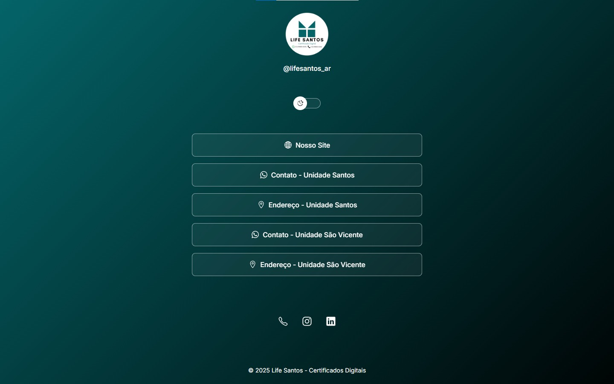

<h1 align="center"> Cartão de Visitas - Life Santos </h1>

Cartão de Visitas com informações de uma certificadora digital porfissional e de qualidade

  <a href="#-tecnologias">Tecnologias</a>&nbsp;&nbsp;&nbsp;|&nbsp;&nbsp;&nbsp;
  <a href="#-projeto">Projeto</a>&nbsp;&nbsp;&nbsp;|&nbsp;&nbsp;&nbsp;

 

  

## 🚀 Tecnologias

Esse projeto foi desenvolvido com as seguintes tecnologias: 

- HTML e CSS
- JavaScript
- Git e Github
- JavaScript Object Notation

## 💻 Projeto

Apresento o Cartão de Visitas Digital da certificadora digital Life Santos, uma forma prática e elegante de compartilhar informações de contato, exibir endereços e unidades e conectar com as redes sociais. Ideal para perfis comerciais no Instagram e outras plataformas, ele facilita a interação com clientes e parceiros de maneira rápida, segura e profissional.

---

Feito por Riquelme Guedes
